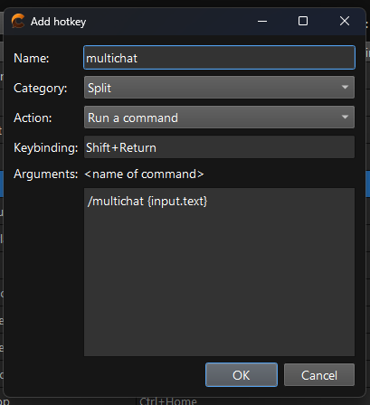

# chatterino multichat

a simple chatterino plugin that lets you send the same message to two twitch channels at the same time.

## features

- `enter` → sends only to the current channel
- `shift + enter` → sends to both channels
- 800ms delay between messages
- no bot account required
- no external software required
- lightweight lua plugin

## setup

### 1. configure your channels

open `chatterino_multichat/init.lua`.

at the top of the file, change `channel_2` and `channel_2` to the channels you want.

### 2. install the plugin

open the `chatterino_multichat` folder in this repository and download `init.lua` and `info.json`.

put both files inside a new `chatterino_multichat` folder in your chatterino `plugins` folder.

your folder should look like this:

    plugins/
    └── chatterino_multichat/
        ├── init.lua
        └── info.json

restart chatterino after installing the plugin.

### 3. open both channels

make sure both configured channels are open in chatterino.

### 4. set up the hotkey

go to `settings → hotkeys → add`.

use these settings:

- **name:** `multichat`
- **category:** `split`
- **action:** `run a command`
- **keybinding:** `shift + enter`
- **arguments:** `/multichat {input.text}`

click `ok` and you're ready to use it.

## usage

### normal message

press `enter`.

the message will only be sent to the channel you're currently typing in.

### send to both channels

press `shift + enter`.

the message will be sent to the current channel and then to the other configured channel 800ms later.

## changing the delay

the default delay is 800ms.

you can change it in `init.lua` by changing the `DELAY` value.

for example, `1000` means a 1 second delay.

## troubleshooting

### current channel is not configured

make sure the channel you're currently typing in is one of the two channels configured in `init.lua`.

### target channel is not open

make sure both configured channels are open in chatterino.

### shift + enter is not working

make sure your chatterino hotkey is configured as:

- **category:** `split`
- **action:** `run a command`
- **keybinding:** `shift + enter`
- **arguments:** `/multichat {input.text}`

## important

this plugin does not bypass twitch chat restrictions or rate limits.

if your account cannot normally send messages in a channel, this plugin will not bypass that restriction.

both channels must be open in chatterino.

